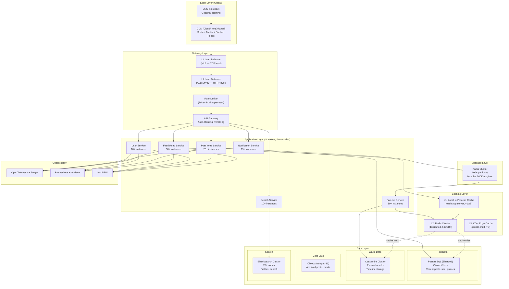
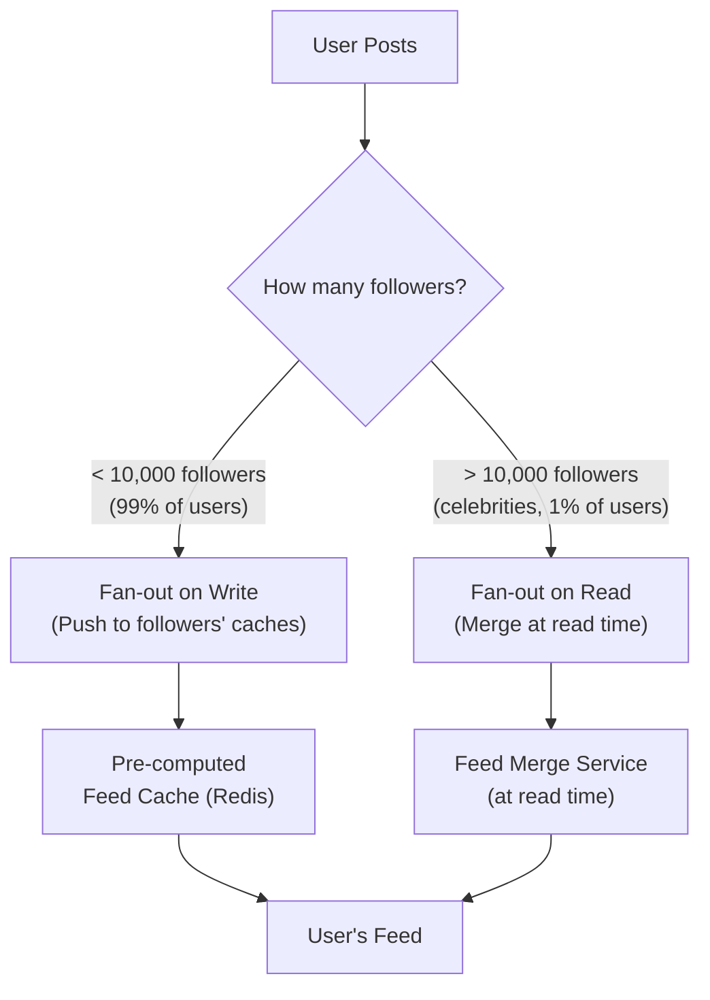
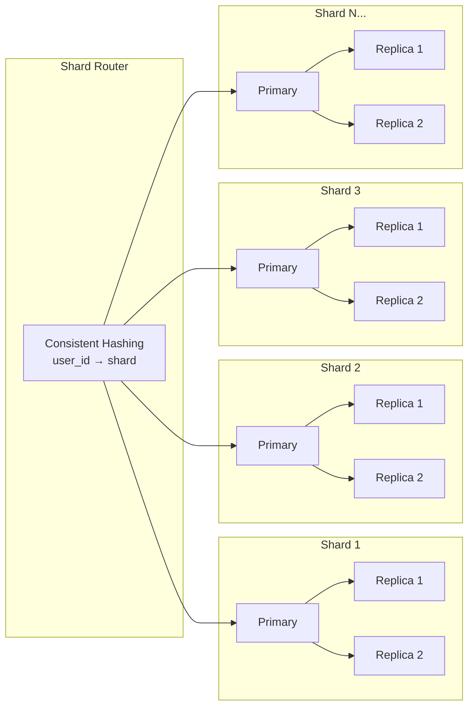
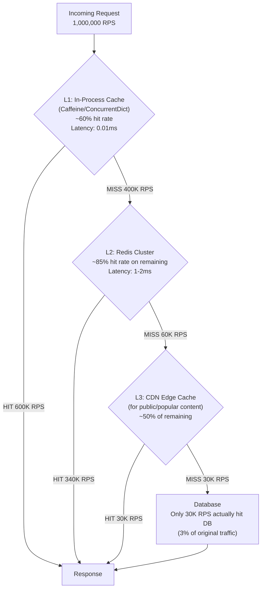
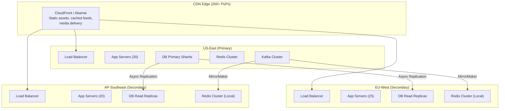

# Designing for 20M+ Users & 1M Requests/Second

## The Domain: Real-Time Social Feed Platform (like Twitter/X)

Why this domain? Because it naturally hits every hard problem at this scale:
- **Write-heavy**: Millions of posts/sec
- **Read-heavy**: Fan-out to millions of followers
- **Real-time**: Feed must update in < 2 seconds
- **Mixed workloads**: Reads are 100x more frequent than writes

---

## Step 0: The Math — Before You Architect, You Calculate

> [!IMPORTANT]
> At 1M RPS, gut feeling doesn't work. You need **back-of-the-envelope calculations** for every component. If the math doesn't work on paper, it won't work in production.

### Traffic Analysis

```
Total users:           20,000,000
Daily Active Users:    ~12,000,000 (60% DAU — typical for social platforms)
Peak RPS:              1,000,000
Average RPS:           ~300,000 (peak is ~3x average)

Read : Write ratio:    100 : 1 (typical for social feeds)
├── Read RPS:          ~990,000
└── Write RPS:         ~10,000
```

### Data Volume Estimation

```
Average post size:     ~1 KB (text + metadata, no media)
Posts per day:          ~50,000,000 (avg 4 posts/active user)
New data per day:      50M × 1 KB = ~50 GB/day
New data per year:     ~18 TB/year (posts only)

Media (images/video):  Average 500 KB per media post
30% of posts have media: 15M × 500 KB = ~7.5 TB/day media
```

### Bandwidth Estimation

```
Incoming (writes):     10,000 RPS × 1 KB = ~10 MB/s
Outgoing (reads):      990,000 RPS × 5 KB (post + metadata) = ~5 GB/s

5 GB/s outgoing — this is MASSIVE.
A single server with 10 Gbps NIC handles ~1.2 GB/s.
You need at minimum 5 servers JUST for bandwidth.
(In practice, 20-30 after overhead.)
```

### Latency Budget

```
Total target: p99 < 200ms

Budget breakdown:
├── CDN / Edge cache lookup:     5ms
├── Load Balancer → App Server:  2ms
├── Application logic:           10ms
├── Cache lookup (Redis):        1-2ms
├── Database (if cache miss):    20-50ms
├── Serialization / Response:    5ms
└── Network return:              10-50ms (depends on geo)

Remaining buffer:                ~80ms
```

> [!TIP]
> **Why p99, not average?** Because average latency hides the pain. If your average is 50ms but p99 is 3 seconds, 1% of 1M RPS = **10,000 users per second** getting a terrible experience.

---

## Step 1: High-Level Architecture



---

## Step 2: The Hardest Problem — Feed Generation (Fan-Out)

This is THE defining challenge for a social platform at scale. When User A posts something, how do their 10,000 followers see it?

### Two Approaches

| Approach | How It Works | Pros | Cons |
|---|---|---|---|
| **Fan-out on Write** (Push) | When User A posts, immediately write to all followers' timelines | Reads are instant (pre-computed) | Expensive writes for celebrities (10M followers = 10M writes) |
| **Fan-out on Read** (Pull) | When User B opens feed, query all followed users' recent posts | Writes are cheap | Reads are expensive (must merge N timelines) |

### My Solution: Hybrid Fan-Out

This is what Twitter/X actually does. Neither pure push nor pure pull works alone at this scale.



### Why Hybrid?

```
Normal user posts (99% of posts):
├── Followers: ~500 average
├── Fan-out writes: 500 cache insertions
├── Time: ~5ms
└── Result: All 500 followers see it instantly in their cached feed

Celebrity posts (1% of posts):
├── Followers: 5,000,000
├── If we pushed: 5M cache writes × 1ms each = 83 minutes to propagate 🔥
├── Instead: We DON'T fan out
└── Result: When a user opens their feed, we merge their pre-computed feed 
    with fresh queries to celebrity accounts they follow
```

### Feed Cache Structure (Redis)

```
Key: feed:{user_id}
Type: Sorted Set (sorted by timestamp)
Max size: 800 posts (most users never scroll past 200)

ZADD feed:user123 1711738800 "post:abc123"
ZADD feed:user123 1711738900 "post:def456"

ZREVRANGE feed:user123 0 19  → Get latest 20 posts (page 1)
ZREVRANGE feed:user123 20 39 → Get next 20 posts (page 2)
```

```
Memory calculation:
├── 12M DAU × 800 posts × ~100 bytes per entry
├── = ~960 GB
├── With Redis Cluster (6 primaries + 6 replicas)
├── = ~160 GB per primary shard
└── Fits in memory on r6g.4xlarge instances (128 GB each, with headroom)
```

---

## Step 3: Database Sharding — You Cannot Avoid This

At 50 GB/day new data, a single database server dies. You need **horizontal sharding**.

### Sharding Strategy



### Shard Key Selection — The Most Critical Decision

| Shard Key | Pros | Cons |
|---|---|---|
| `user_id` ✅ | All user's posts on one shard, user-centric queries are fast | Celebrity shards get hot |
| `post_id` | Even distribution | "Get user's posts" requires scatter-gather across ALL shards |
| `created_at` | Time-range queries easy | Recent shard is always hot, old shards idle |
| `user_id + time bucket` ✅✅ | Best of both — user locality + time-based distribution | Slightly more complex routing |

**I choose: `user_id` with hot-shard mitigation**

```
Shard routing: shard_number = hash(user_id) % NUM_SHARDS

For celebrities (hot shards):
├── Dedicated shard group with beefier hardware
├── Read replicas scaled 4x compared to normal shards
└── Aggressive caching at the application level
```

### How Many Shards?

```
Target: Each shard handles ~5,000 write TPS
Total write TPS: ~10,000
Minimum shards: 10,000 / 5,000 = 2 (for writes alone)

But reads matter more:
Target: Each shard handles ~20,000 read TPS (with replicas)
Total read TPS hitting DB (after cache): ~50,000 (95% cache hit rate)
Minimum shards: 50,000 / 20,000 = 3

Start with 16 shards (power of 2, room to grow)
Each shard: 1 primary + 2 read replicas = 48 database instances total
```

> [!WARNING]
> **Resharding is painful.** Start with enough shards. Going from 16 → 32 shards requires data migration. Use **consistent hashing** (not modulo) so resharding only moves ~1/N of the data instead of reshuffling everything.

---

## Step 4: Multi-Layer Caching — The Key to 1M RPS

At 1M RPS, you CANNOT hit the database for every request. Your cache hit rate must be **> 95%**. Here's the strategy:



### Cache Invalidation Strategy

> "There are only two hard things in Computer Science: cache invalidation and naming things." — Phil Karlton

```
Strategy: Write-Through + TTL + Event-Based Invalidation

1. WRITE-THROUGH:
   When a post is created:
   ├── Write to DB
   ├── Write to Redis (immediate)
   └── Publish "PostCreated" event → Fan-out Service updates follower feed caches

2. TTL (Time-To-Live):
   ├── User profiles: TTL = 5 minutes (changes are rare)
   ├── Feed cache: TTL = 10 minutes (constantly refreshed by fan-out)
   ├── Post content: TTL = 1 hour (posts don't change after creation)
   └── Trending topics: TTL = 30 seconds (must be fresh)

3. EVENT-BASED INVALIDATION:
   When a post is deleted:
   ├── Delete from DB
   ├── Publish "PostDeleted" event
   ├── Redis subscriber removes from all affected feed caches
   └── CDN cache purge API called for that post's URL
```

### L1 Cache: The Unsung Hero

```csharp
// In-process cache — no network hop, no serialization
// This alone eliminates 60% of requests from hitting Redis

public class L1Cache
{
    // Lock-free concurrent dictionary with size limit
    private readonly ConcurrentDictionary<string, CacheEntry> _cache = new();
    private const int MAX_ENTRIES = 100_000; // ~100MB per instance
    
    public T? Get<T>(string key)
    {
        if (_cache.TryGetValue(key, out var entry))
        {
            if (entry.ExpiresAt > DateTime.UtcNow)
            {
                Interlocked.Increment(ref _hits);
                return (T)entry.Value;
            }
            _cache.TryRemove(key, out _); // Expired
        }
        Interlocked.Increment(ref _misses);
        return default;
    }
}
```

> [!CAUTION]
> **L1 cache consistency problem**: With 50 app server instances, each has its own L1 cache. If a post is deleted, 50 L1 caches might still serve it for up to TTL duration. For social feeds, a 30-second stale window is acceptable. For financial data, it's not — skip L1 for those.

---

## Step 5: Message Queue at Scale — Kafka Deep Dive

At this scale, RabbitMQ can't keep up. You need **Apache Kafka**.

### Why Kafka?

```
RabbitMQ: ~50,000 messages/sec (good for microservices)
Kafka:    ~2,000,000 messages/sec per broker (good for this scale)

Kafka is not a message queue — it's a distributed commit log.
Messages are durable, replayable, and ordered within partitions.
```

### Kafka Topology

```
Topic: posts.created
├── Partition 0  → Consumer Group: fan-out-service (instance 1)
├── Partition 1  → Consumer Group: fan-out-service (instance 2)
├── Partition 2  → Consumer Group: fan-out-service (instance 3)
├── ...
├── Partition 99 → Consumer Group: fan-out-service (instance 30)
└── Replication Factor: 3 (data on 3 brokers for durability)

Topic: posts.deleted
├── 50 partitions
└── Consumers: feed-invalidation-service, search-service, analytics-service

Topic: user.activity
├── 200 partitions (highest volume)
└── Consumers: analytics-service, recommendation-service, ad-targeting-service
```

### Partition Key Strategy

```csharp
// Partition by user_id — guarantees ordering per user
var message = new Message<string, PostCreatedEvent>
{
    Key = post.UserId.ToString(),  // Same user's events always go to same partition
    Value = new PostCreatedEvent(post.Id, post.UserId, post.Content)
};

// Why does ordering matter?
// If user creates post A then deletes post A:
// ├── Without ordering: Delete might be processed before Create → post never deleted
// └── With ordering: Create is always processed before Delete ✅
```

### Kafka Cluster Sizing

```
Requirements:
├── Write throughput: 500K messages/sec
├── Average message size: 1 KB
├── Retention: 7 days
├── Replication factor: 3

Calculations:
├── Write bandwidth: 500K × 1KB = 500 MB/s
├── With replication: 500 MB/s × 3 = 1.5 GB/s total disk write
├── Storage (7 days): 500 MB/s × 86,400 × 7 × 3 replicas = ~900 TB
│
├── Broker count: 1.5 GB/s ÷ 200 MB/s per broker = 8 brokers minimum
├── With headroom: 12 brokers (50% headroom for spikes)
└── Disk per broker: 900 TB ÷ 12 = ~75 TB NVMe SSD each
```

---

## Step 6: Connection & Thread Pool Management

At 1M RPS, you'll exhaust resources you never thought about.

### Connection Pooling

```
Problem: 1M RPS with a new TCP connection per request = disaster
├── TCP handshake: ~1ms (3-way handshake)
├── TLS handshake: ~5ms (additional roundtrips)
├── 1M × 6ms = 6,000,000 ms of just handshaking per second
└── That's 6,000 concurrent connections just for handshakes 💀

Solution: Connection Pools + HTTP/2 + Keep-Alive

App Server → Redis:
├── Pool size: 200 connections per instance
├── 50 instances × 200 connections = 10,000 total Redis connections
└── Each connection handles ~100 commands/sec via pipelining

App Server → Database:
├── Pool size: 50 connections per instance
├── 50 instances × 50 connections = 2,500 total DB connections
├── Each connection handles ~20 queries/sec
└── Total: 50,000 queries/sec → matches our post-cache DB traffic
```

### Thread Management

```csharp
// DON'T: Create/destroy threads per request
// DO: Use async I/O everywhere

// At 1M RPS with synchronous I/O:
// Each request holds a thread for ~50ms
// Concurrent threads needed: 1,000,000 × 0.05 = 50,000 threads
// Each thread: ~1MB stack = 50 GB of RAM just for thread stacks 💀

// With async I/O:
// Each request is a lightweight state machine (~few hundred bytes)
// 1,000,000 concurrent requests ≈ ~500 MB of memory ✅

public async Task<Feed> GetFeedAsync(string userId)
{
    // No thread blocked during I/O waits
    var cachedFeed = await _redis.GetAsync($"feed:{userId}");
    if (cachedFeed != null) return Deserialize(cachedFeed);
    
    var posts = await _db.GetRecentPostsAsync(userId);
    await _redis.SetAsync($"feed:{userId}", Serialize(posts), TimeSpan.FromMinutes(10));
    return posts;
}
```

---

## Step 7: Rate Limiting & Load Shedding

At 1M RPS, you MUST protect yourself from both malicious and legitimate traffic spikes.

### Rate Limiting: Token Bucket Algorithm (Distributed)

```
Per-user rate limit: 100 requests/minute
Global rate limit: 1,200,000 requests/second (20% above normal peak)

Implementation: Redis-based distributed token bucket

Key: rate_limit:{user_id}
Algorithm:
├── Each user gets 100 tokens per minute
├── Each request consumes 1 token
├── When tokens = 0, return HTTP 429 (Too Many Requests)
└── Tokens refill at a constant rate (not all at once)
```

```csharp
public async Task<bool> IsAllowed(string userId)
{
    var key = $"rate_limit:{userId}";
    
    // Lua script runs atomically in Redis — no race conditions
    var luaScript = @"
        local tokens = redis.call('GET', KEYS[1])
        if tokens == false then
            redis.call('SET', KEYS[1], 99, 'EX', 60)
            return 1
        elseif tonumber(tokens) > 0 then
            redis.call('DECR', KEYS[1])
            return 1
        else
            return 0
        end
    ";
    
    var result = await _redis.ScriptEvaluateAsync(luaScript, new { Keys = new[] { key } });
    return (int)result == 1;
}
```

### Load Shedding: When 1M Becomes 2M

```
What happens when traffic spikes to 2M RPS? (DDoS, viral moment, etc.)

Strategy: Progressive Load Shedding

Level 1 (1.0 - 1.2M RPS): Normal operation
Level 2 (1.2 - 1.5M RPS): 
├── Disable non-critical features (trending, recommendations)
├── Increase cache TTLs (serve slightly stale data)
└── Return cached responses without personalization

Level 3 (1.5 - 2.0M RPS):
├── Serve fully static cached feeds (no real-time updates)
├── Queue writes instead of processing immediately
└── Return 503 for low-priority endpoints (search, profile edits)

Level 4 (> 2.0M RPS):
├── Enable "read-only mode" — no new posts accepted
├── Serve purely from CDN edge caches
└── Alert on-call engineers
```

---

## Step 8: Geographic Distribution

20M users aren't all in one country. You need multi-region.



### Multi-Region Strategy

```
Reads: Served from the NEAREST region
├── EU user reads feed → EU-West app servers + EU Redis + EU DB read replicas
├── Latency: ~20ms (in-region)
└── vs ~150ms if served from US-East

Writes: Routed to PRIMARY region (US-East)
├── EU user creates post → routed to US-East primary
├── Latency: ~150ms for the write (acceptable — user doesn't notice)
├── Async replication to EU-West and AP-Southeast within ~500ms
└── Writer's feed is immediately updated locally (read-your-own-writes consistency)
```

> [!NOTE]
> **Why not multi-master?** Multi-master writes introduce conflict resolution complexity (last-write-wins, CRDTs, etc.). For a social feed, the complexity isn't worth it. Writes are infrequent per user, and 150ms write latency is fine. For a chat/messaging system, you'd need multi-master.

---

## Step 9: Complete Infrastructure Bill of Materials

### Compute

| Component | Instance Type | Count | Purpose |
|---|---|---|---|
| Feed Read Service | c6g.2xlarge (8 vCPU, 16GB) | 50 | Handle 990K read RPS |
| Post Write Service | c6g.xlarge (4 vCPU, 8GB) | 20 | Handle 10K write RPS |
| Fan-out Service | c6g.2xlarge (8 vCPU, 16GB) | 30 | Push posts to follower caches |
| Search Service | r6g.2xlarge (8 vCPU, 64GB) | 10 | Full-text search |
| Notification Service | c6g.xlarge (4 vCPU, 8GB) | 15 | Push/email/SMS |
| User Service | c6g.xlarge (4 vCPU, 8GB) | 10 | Auth, profiles |

### Data Stores

| Component | Instance/Config | Count | Data Size |
|---|---|---|---|
| PostgreSQL (Sharded) | r6g.4xlarge (128GB RAM) | 48 (16 shards × 3) | ~200 TB |
| Redis Cluster | r6g.4xlarge (128GB RAM) | 12 (6 primary + 6 replica) | ~960 GB feeds |
| Cassandra | i3.4xlarge (122GB, NVMe) | 24 (RF=3) | ~500 TB timelines |
| Elasticsearch | r6g.2xlarge (64GB RAM) | 20 | ~50 TB index |
| Kafka | i3.2xlarge (NVMe SSDs) | 12 | ~900 TB retention |

### Networking

| Component | Count | Purpose |
|---|---|---|
| CDN PoPs | 200+ | Static assets, media, cached feeds |
| Load Balancers (L4) | 6 (2 per region) | TCP-level load balancing |
| Load Balancers (L7) | 12 (4 per region) | HTTP routing, TLS termination |

### Estimated Monthly Cost

```
Compute:    ~135 instances × avg $400/mo          = ~$54,000
Database:   ~48 instances × avg $2,000/mo          = ~$96,000
Redis:      ~12 instances × avg $1,500/mo          = ~$18,000
Cassandra:  ~24 instances × avg $1,800/mo          = ~$43,200
Kafka:      ~12 instances × avg $1,500/mo          = ~$18,000
Elastic:    ~20 instances × avg $800/mo            = ~$16,000
CDN:        5 GB/s × 2.6M sec/mo × $0.02/GB       = ~$260,000
S3:         ~1 PB media × $0.023/GB                = ~$23,000
Bandwidth:  ~15 PB/mo @ $0.05/GB                   = ~$750,000
─────────────────────────────────────────────────────────────
TOTAL:      ~$1,280,000/month  (~$15.4M/year)

Per user cost: $1,280,000 / 20,000,000 = $0.064 per user per month
```

> [!WARNING]
> **Bandwidth is the dominant cost.** 60% of the bill is data transfer. This is why CDN strategy and media compression are critical. Serving images as WebP instead of PNG can cut bandwidth 40%.

---

## Step 10: What Breaks First at Each Scale Milestone

| Users | RPS | What Breaks | Fix |
|---|---|---|---|
| 10K | 100 | Nothing, monolith works fine | Don't over-engineer |
| 100K | 1,000 | Database connections | Connection pooling, read replicas |
| 1M | 10,000 | Single database capacity | Add Redis cache, database sharding |
| 5M | 50,000 | Feed computation latency | Fan-out-on-write, pre-computed feeds |
| 10M | 200,000 | Single-region latency | Multi-region, CDN for feeds |
| 20M | 500,000 | Redis memory, Kafka throughput | Redis cluster, Kafka partitioning |
| 20M+ | **1,000,000** | **Everything above + bandwidth costs** | **Full architecture described in this doc** |

---

## Step 11: Deployment & Zero-Downtime Releases

### Canary Deployments

```
At 1M RPS, a bad deploy can affect millions of users in seconds.

Canary strategy:
├── Deploy new version to 1% of instances (1 server)
├── Monitor for 10 minutes:
│   ├── Error rate < 0.1%?
│   ├── p99 latency < 200ms?
│   ├── No increase in 5xx responses?
│   └── Memory/CPU within bounds?
├── If healthy: Roll to 10% → 25% → 50% → 100%
├── If unhealthy: Automatic rollback in < 60 seconds
└── Full rollout takes ~45 minutes
```

### Feature Flags

```csharp
// NEVER deploy a new feature by deploying new code at this scale
// Use feature flags to decouple deployment from release

if (_featureFlags.IsEnabled("new-feed-algorithm", userId))
{
    return await _newFeedService.GetFeed(userId);  // New algorithm
}
else
{
    return await _legacyFeedService.GetFeed(userId); // Current algorithm
}

// Gradual rollout: 1% → 5% → 25% → 50% → 100%
// Instant killswitch if metrics degrade
```

---

## Key Takeaways for Interview / Real-World

### The 5 things that matter most at 1M RPS:

1. **Cache everything, everywhere** — L1 (process), L2 (Redis), L3 (CDN). Your cache hit rate determines your survival. 95%+ or go home.

2. **Async by default** — Don't make users wait for work that can happen in the background. Kafka handles the heavy lifting.

3. **Shard early, shard smart** — Choose the right shard key. Consistent hashing. Over-provision shards because resharding is painful.

4. **Fan-out strategy is THE architecture** — Hybrid fan-out (push for normal users, pull for celebrities) is the only approach that works at this scale.

5. **Observe everything** — You cannot fix what you cannot see. Distributed tracing, metrics, and alerting are non-negotiable.

### The Mental Model

```
"How do I handle 1M RPS?"

Answer: You DON'T handle 1M RPS.

├── CDN handles 300K RPS (static, cached)
├── L1 cache handles 400K RPS (in-process, zero-latency)
├── Redis handles 250K RPS (distributed cache)
├── Database handles only 50K RPS (the residual 5%)
└── Each layer absorbs traffic so the next layer sees less

1M RPS at the edge → 50K RPS at the database.
THAT's how you design for scale.
```
