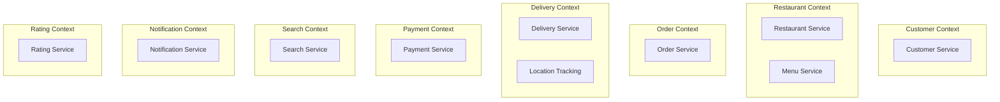
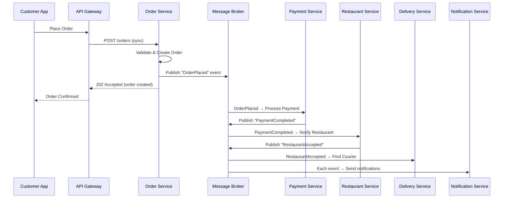
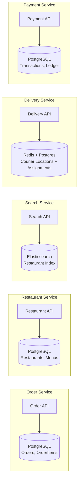
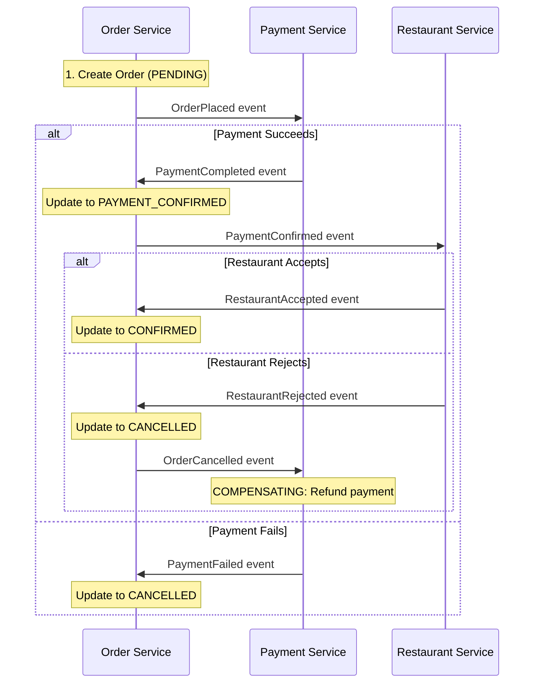
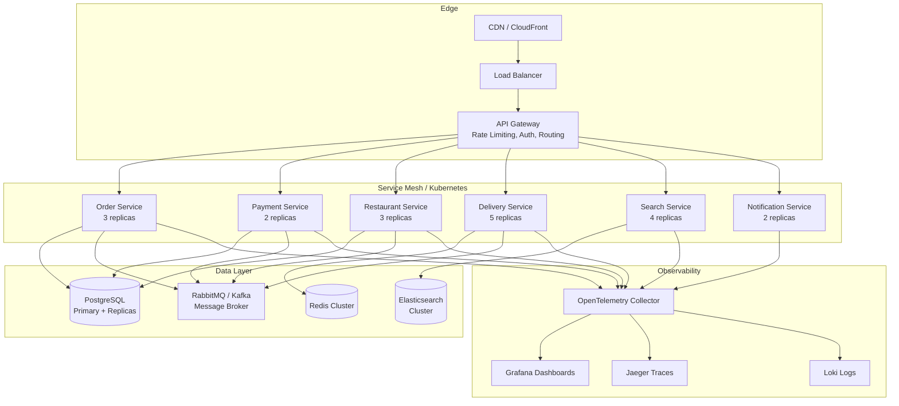

# Designing a Microservices System — A Senior Engineer's Thought Process

> This document walks through **how** a senior engineer thinks about microservices design — not just the "what", but the "why" behind every decision.

---

## Step 0: The First Question — "Do I Even Need Microservices?"

Before drawing a single box on a whiteboard, the very first question I ask is:

**"Does this problem actually need microservices?"**

Microservices add operational complexity: distributed tracing, network failures, eventual consistency, deployment orchestration. If a well-structured **modular monolith** can solve the problem, that's often the better starting point.

I'd choose microservices when:
- **Multiple teams** need to deploy independently
- **Different scaling profiles** exist (e.g., search is 100x more read-heavy than order processing)
- **Different technology requirements** per domain (ML pipeline in Python, real-time in Go, business logic in C#)
- **Fault isolation** is critical — one component failing shouldn't take down the whole system

> [!IMPORTANT]
> **Rule of thumb**: Start with a modular monolith. Extract services when you feel the pain, not before. Every microservice you add is a distributed systems problem you need to solve.

For this exercise, let's assume we're building at scale and the complexity is justified.

---

## Step 1: Choose the Domain & Understand the Business

I'll design an **Online Food Delivery Platform** (think Uber Eats / DoorDash). This domain is rich enough to demonstrate real microservices patterns.

### Core Business Capabilities

Before thinking about services, I think about **what the business does**:

| Business Capability | Description |
|---|---|
| Customer Management | Registration, profiles, addresses, preferences |
| Restaurant Management | Restaurant onboarding, menus, availability, hours |
| Order Management | Cart → Order → Payment → Fulfillment lifecycle |
| Delivery Management | Courier matching, route optimization, real-time tracking |
| Payment Processing | Payment capture, refunds, restaurant payouts |
| Notification | Push notifications, SMS, email for all actors |
| Search & Discovery | Restaurant search, filtering, recommendations |
| Rating & Reviews | Post-delivery feedback for restaurants and couriers |

> [!TIP]
> **Why start with business capabilities, not technical components?**  
> Because microservice boundaries should align with **business boundaries**, not technical layers. This comes from Domain-Driven Design (DDD). If you split by technical layers (API, Business Logic, Data), you get a distributed monolith — the worst of both worlds.

---

## Step 2: Identify Bounded Contexts (DDD)

This is the most critical step. Get the boundaries wrong, and you'll spend years refactoring.

### How I Find Boundaries

I use three heuristics:

1. **Language Test**: If the same word means different things in different contexts, that's a boundary. "Order" means something different to the kitchen (items to prepare) vs. the courier (pickup/dropoff addresses) vs. payments (an amount to charge).

2. **Change Frequency Test**: Things that change together should live together. Menu pricing changes should NOT require redeploying the delivery tracking system.

3. **Team Ownership Test**: Each service should be ownable by a single team (2-pizza team, ~5-8 people). If a service needs input from 3 teams to make a change, it's too big.

### The Bounded Contexts



> [!NOTE]
> Notice that **Menu** is its own service separate from **Restaurant**. Why? Because menus change frequently (daily specials, out-of-stock items), while restaurant metadata (name, address, hours) changes rarely. Different change frequencies → different services.

---

## Step 3: Define Service Responsibilities & APIs

For each service, I define a clear responsibility boundary using the **Single Responsibility Principle** at the service level.

### Order Service — The Orchestrator

This is the most complex service. It manages the **order lifecycle**:

```
Cart → Order Placed → Payment Confirmed → Restaurant Accepted → 
Preparing → Ready for Pickup → Courier Assigned → Picked Up → Delivered
```

```csharp
// Order Service API — what it owns
POST   /api/orders              // Create order from cart
GET    /api/orders/{id}         // Get order details
PUT    /api/orders/{id}/status  // Update order status (internal)
GET    /api/orders/customer/{customerId}  // Customer's order history
POST   /api/orders/{id}/cancel  // Cancel an order

// What it does NOT own:
// ❌ Payment processing (delegates to Payment Service)
// ❌ Courier assignment (delegates to Delivery Service)  
// ❌ Sending notifications (publishes events, Notification Service listens)
```

### Key Design Decision: Thin vs. Fat Services

> [!IMPORTANT]
> The Order Service **coordinates** but doesn't **do everything**. It publishes an `OrderPlaced` event and lets other services react. It doesn't call the Payment API, then the Restaurant API, then the Delivery API in sequence — that would create tight coupling and a distributed monolith.

---

## Step 4: Communication Patterns — This Is Where It Gets Real

### Synchronous (Request/Response) vs. Asynchronous (Event-Driven)

This is the most impactful architectural decision. Here's my mental model:

| Use Sync (HTTP/gRPC) When... | Use Async (Events/Messages) When... |
|---|---|
| You need an immediate response | The caller doesn't need to wait |
| The operation is a query (read) | The operation is a command (write) |
| Strong consistency is required | Eventual consistency is acceptable |
| The call is in the request path | The work can happen in the background |

### Applied to Our System



### Why Async for the Order Flow?

1. **Resilience**: If the Payment Service is down for 30 seconds, the message sits in the queue and gets processed when it recovers. With sync calls, the customer gets a 500 error.

2. **Decoupling**: The Order Service doesn't know or care about the Notification Service. It just publishes events. Tomorrow, if we add an Analytics Service, it subscribes to the same events — zero changes to Order Service.

3. **Scalability**: Each service processes messages at its own pace. Payment might handle 100/sec while Notification handles 10,000/sec.

### When I Use Sync (gRPC)

```
Customer App → API Gateway → Search Service: "Find restaurants near me"
```

This is a **query** where the user is waiting for results. Async doesn't make sense here. I'd use **gRPC** for internal service-to-service sync calls (binary protocol, strongly typed, ~10x faster than JSON over HTTP).

---

## Step 5: Data Management — Database per Service

### The Rule

> Each service owns its data. No service directly accesses another service's database. Period.



### Why Different Databases?

| Service | Database | Reason |
|---|---|---|
| Order, Payment, Restaurant | PostgreSQL | Transactional integrity, ACID compliance |
| Search | Elasticsearch | Full-text search, geo-queries, faceted filtering |
| Delivery (Location) | Redis | Sub-millisecond reads for real-time courier positions |
| Notification | None (stateless) | Just processes messages, no persistent state needed |

> [!WARNING]
> **"But what about data duplication?"** — Yes, the Search Service has a copy of restaurant data. This is **intentional**. The Search Service builds its own read-optimized index from `RestaurantUpdated` events. This is the **CQRS pattern** (Command Query Responsibility Segregation). Writes go to the source service; reads come from optimized projections.

---

## Step 6: Handling Distributed Transactions — The Hard Part

### The Problem

When a customer places an order, we need to:
1. Create the order (Order Service)
2. Charge the customer (Payment Service)  
3. Reserve the items (Restaurant Service)

In a monolith, this is one database transaction. In microservices, **distributed transactions (2PC) don't work** at scale — they're slow, fragile, and create tight coupling.

### Solution: The Saga Pattern

I use the **Choreography-based Saga** for most flows, and **Orchestration-based Saga** for complex multi-step workflows.

#### Order Placement Saga (Choreography)



#### The Compensating Actions

Each step has a corresponding **undo** action:

| Forward Action | Compensating Action |
|---|---|
| Charge customer | Refund customer |
| Reserve items at restaurant | Release reserved items |
| Assign courier | Unassign courier |

> [!CAUTION]
> **Compensating actions must be idempotent.** If a "Refund" message is delivered twice (which WILL happen in distributed systems), the second refund must be a no-op. Implement this with idempotency keys.

---

## Step 7: The Outbox Pattern — Reliable Event Publishing

### The Problem

```csharp
// THIS IS BROKEN — don't do this
public async Task PlaceOrder(OrderRequest request)
{
    var order = new Order(request);
    await _dbContext.Orders.AddAsync(order);
    await _dbContext.SaveChangesAsync();     // Step 1: Save to DB
    
    await _messageBroker.PublishAsync(        // Step 2: Publish event
        new OrderPlacedEvent(order.Id));
    // What if the app crashes between Step 1 and Step 2?
    // The order is saved but the event is never published.
    // The Payment Service never knows about this order. 💀
}
```

### The Solution: Transactional Outbox

```csharp
// CORRECT — Outbox Pattern
public async Task PlaceOrder(OrderRequest request)
{
    var order = new Order(request);
    var outboxMessage = new OutboxMessage
    {
        Id = Guid.NewGuid(),
        Type = nameof(OrderPlacedEvent),
        Payload = JsonSerializer.Serialize(new OrderPlacedEvent(order.Id)),
        CreatedAt = DateTime.UtcNow,
        ProcessedAt = null
    };

    // Both saved in the SAME database transaction
    await _dbContext.Orders.AddAsync(order);
    await _dbContext.OutboxMessages.AddAsync(outboxMessage);
    await _dbContext.SaveChangesAsync(); // Atomic — both succeed or both fail
}

// Background worker polls the Outbox table and publishes to the message broker
public class OutboxProcessor : BackgroundService
{
    protected override async Task ExecuteAsync(CancellationToken ct)
    {
        while (!ct.IsCancellationRequested)
        {
            var messages = await GetUnprocessedMessages();
            foreach (var msg in messages)
            {
                await _messageBroker.PublishAsync(msg.Type, msg.Payload);
                msg.ProcessedAt = DateTime.UtcNow;
                await _dbContext.SaveChangesAsync();
            }
            await Task.Delay(TimeSpan.FromSeconds(1), ct);
        }
    }
}
```

> [!TIP]
> For production, consider using **Change Data Capture (CDC)** with Debezium instead of polling. It tails the database transaction log, so there's no polling delay and no risk of missed events.

---

## Step 8: Resilience Patterns

In distributed systems, **failure is not exceptional — it's expected.** Here's how I prepare for it:

### Circuit Breaker

```
Order Service → [Circuit Breaker] → Payment Service
                     |
                     ├── CLOSED: Normal operation, requests flow through
                     ├── OPEN: Payment Service is down, fail fast (don't waste resources)
                     └── HALF-OPEN: Try one request to see if it recovered
```

Use libraries like **Polly** (C#) or **Resilience4j** (Java).

### Retry with Exponential Backoff + Jitter

```csharp
// Don't do: retry immediately, 3 times → thundering herd
// Do: retry with exponential backoff + jitter
var retryPolicy = Policy
    .Handle<HttpRequestException>()
    .WaitAndRetryAsync(
        retryCount: 3,
        sleepDurationProvider: attempt => 
            TimeSpan.FromSeconds(Math.Pow(2, attempt)) + // exponential
            TimeSpan.FromMilliseconds(Random.Shared.Next(0, 1000)) // jitter
    );
```

### Bulkhead Isolation

Separate thread pools for different downstream calls. If the Restaurant Service is slow, it shouldn't exhaust the thread pool and prevent calls to the Payment Service.

### Timeouts

Every external call has a timeout. No exceptions.

```csharp
var httpClient = new HttpClient
{
    Timeout = TimeSpan.FromSeconds(5) // Fail fast, don't wait forever
};
```

---

## Step 9: Infrastructure & Observability

### The "Three Pillars" of Observability

In a monolith, you `Console.WriteLine` and check the log file. In microservices, a single request touches 5+ services. You need:

| Pillar | Tool | Why |
|---|---|---|
| **Distributed Tracing** | Jaeger / Zipkin / OpenTelemetry | Follow a request across services. "Why was this order slow?" |
| **Centralized Logging** | ELK Stack / Seq / Grafana Loki | Aggregate logs from all services into one searchable place |
| **Metrics** | Prometheus + Grafana | Dashboards for latency, error rates, throughput per service |

### Correlation IDs

Every request gets a unique `X-Correlation-Id` header at the API Gateway. This ID is propagated through every service call and every log entry. When a customer reports "my order failed", you search by correlation ID and see the entire journey.

### Infrastructure Architecture



### Deployment: Kubernetes

Each service is a container with:
- **Horizontal Pod Autoscaler (HPA)**: Scale based on CPU/memory/custom metrics
- **Health checks**: Liveness and readiness probes
- **Resource limits**: So one runaway service can't starve others
- **Rolling deployments**: Zero-downtime deployments

---

## Step 10: API Gateway & Cross-Cutting Concerns

The API Gateway is the single entry point. It handles:

| Concern | Details |
|---|---|
| **Authentication** | Validate JWT tokens, extract user context |
| **Rate Limiting** | 100 requests/min per user, burst allowance |
| **Request Routing** | `/api/orders/*` → Order Service, `/api/restaurants/*` → Restaurant Service |
| **Response Caching** | Cache restaurant listings (TTL: 5min) |
| **Request/Response Transformation** | Aggregate data from multiple services for the mobile app (BFF pattern) |
| **SSL Termination** | HTTPS at the edge, internal communication over mTLS |

---

## Common Pitfalls I've Learned the Hard Way

### ❌ Pitfall 1: Distributed Monolith
> "We have 20 microservices but they all need to be deployed together."

**Symptom**: Service A calls Service B calls Service C synchronously for every request.  
**Fix**: Use event-driven communication. Services should be able to function (degraded) when others are down.

### ❌ Pitfall 2: Shared Database
> "Services share a database for convenience."

**Symptom**: One team's schema migration breaks another team's service.  
**Fix**: Database per service. If you need data from another service, use events to build local projections.

### ❌ Pitfall 3: Too Many Services, Too Early
> "We have 50 services and 5 engineers."

**Symptom**: Each engineer owns 10 services, no one understands the whole system.  
**Fix**: Start with a modular monolith. Extract services only when team boundaries or scaling needs demand it.

### ❌ Pitfall 4: Ignoring Data Consistency
> "We'll figure out eventual consistency later."

**Symptom**: Customers get charged but orders aren't created. Refunds go missing.  
**Fix**: Design Sagas and Outbox patterns from day one for any cross-service workflow.

### ❌ Pitfall 5: No Observability
> "We'll add logging later."

**Symptom**: Something breaks in production and 5 engineers spend 3 hours grep-ing through container logs.  
**Fix**: Distributed tracing, centralized logging, and metrics dashboards from the start. This is not optional in microservices.

---

## Summary: My Design Checklist

```
✅ Do I actually need microservices, or will a modular monolith work?
✅ Are service boundaries aligned with business domains (DDD)?
✅ Does each service own its data (no shared databases)?
✅ Am I using async communication for commands, sync for queries?
✅ Do I have Saga patterns for distributed transactions?
✅ Am I using the Outbox pattern for reliable event publishing?
✅ Do all services have circuit breakers, retries, and timeouts?
✅ Is observability (tracing, logging, metrics) built in from day 1?
✅ Can each service be deployed independently?
✅ Can each service function (degraded) when dependencies are down?
```

---

## Recommended Learning Path

| Order | Topic | Resource |
|---|---|---|
| 1 | Domain-Driven Design | "Domain-Driven Design" — Eric Evans |
| 2 | Microservices Patterns | "Microservices Patterns" — Chris Richardson |
| 3 | Distributed Systems | "Designing Data-Intensive Applications" — Martin Kleppmann |
| 4 | Event-Driven Architecture | "Building Event-Driven Microservices" — Adam Bellemare |
| 5 | Hands-On | Build one service with Outbox + Saga. Break it. Fix it. |
